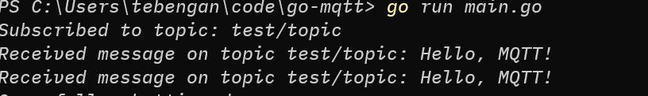

## Installation

- Install Mosquitto broker: https://mosquitto.org/download/
- Run mqtt service

### Subscribe to test/topic

Open terminal and add this command

```bash
mosquitto_sub -h localhost -t test/topic
```

### Publish to test/topic

Open new terminal and add this command

```bash
mosquitto_pub -h localhost -t test/topic -m "Hello, MQTT!"
```

You should get this response

